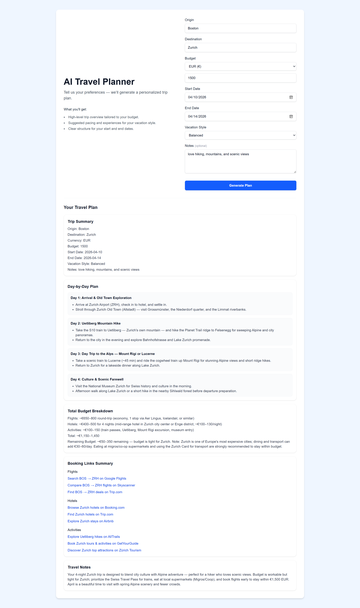

# AI Travel Planner

An AI-powered web application that generates structured travel itineraries using LLM integration and workflow automation.

Live Demo: https://heidi-travel-ai.vercel.app/ 
GitHub: https://github.com/hanxili435/ai-travel-agent

---

## Tech Stack

- Next.js, React, TypeScript  
- n8n (workflow automation)  
- REST API  
- LLM integration  

---

## Screenshot

---
